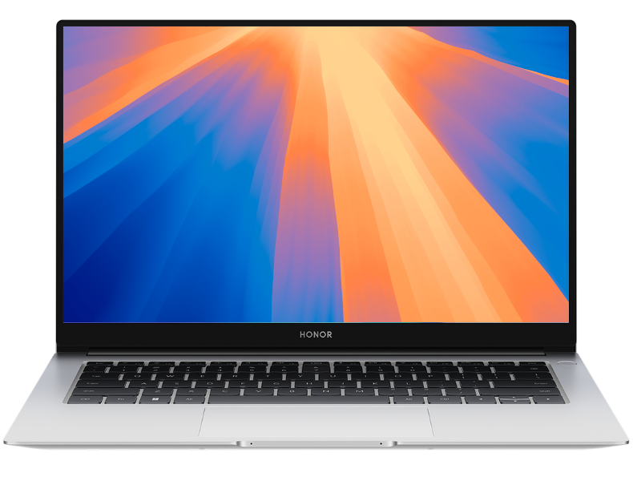

# macOS  on Honor Magicbook X15 2022 

|    macOS    |   |   Status   |
| :--- | :--- | :--- |
|        |   `Stable` Version 15.2 (24C101)  »  latest |   `Current version`   |
|        |   `Stable` 14.3.1 (23D60)  »  latest |   `Compatible`   |
|        |   `Stable` 13 (22A380)  »  13.6.6 (22G630) |   `Compatible`   |
|       |   `Stable` 12.0.1 (21A559)  »  12.5.1 (21G83) |   `Compatible`   |
|        |   `Stable` 11.0.1 (20B29)  »  11.6.8 (20G730) |   `Compatible`   |

 

## <strong>🖥️ Configuration</strong>

  
| Specifications      | Details                                          |
| :--- | :--- |
| Computer model      | Honor Magicbook X15 Space Gray                   |
| Processor           | Intel Core i3-10110U Processor @ 2.6 GHz         |
| Memory              | 8 GB DDR4x2 2400 MHz [Sk Hynix]                  |
| Hard Disk           | SSSTC M.2 NVMe 256 GB [CL1-8D256]                |
| Integrated Graphics | Intel(R) UHD Graphics 620                        |
| Screen              | BOE NV15 Display @ 1920 x 1080 (15.6 inch)       |
| Sound Card          | Realtek ALC256                                   |
| Wireless Card       | Intel Dual Band Wireless-AC 8265/8275            |
| Bluetooth Card      | Intel Bluetooth 8265/8275                        |
